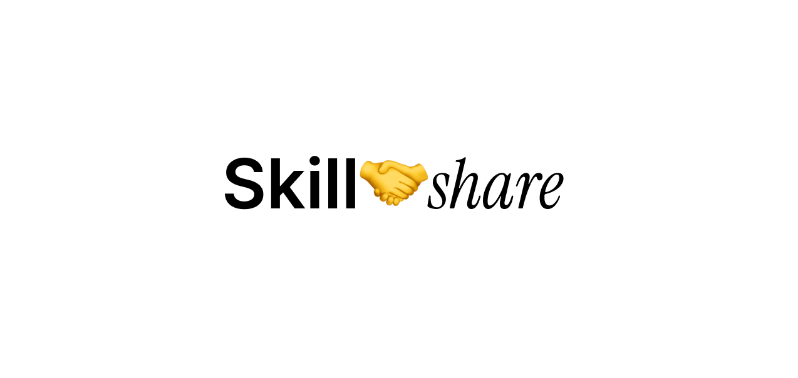

# skillshare-cc

Send and receive Claude Code skills with other users.

```bash
npm install -g skillshare-cc
skillshare init
```

## What it does

Skills are Claude Code slash commands — markdown files in `~/.claude/commands/`. When you send a skill, the file content is delivered to the recipient's inbox. They install it with one click and it's immediately available as a slash command in Claude Code.

## Setup

```bash
npm install -g skillshare-cc
skillshare init        # choose a username, installs hooks + slash commands
skillshare app         # launch the menu bar widget
```

A 🤝 icon appears in your menu bar. Click it to manage your inbox and send skills.

## Friends

You can only exchange skills with friends. Add someone first:

```bash
skillshare friends add @username
```

They'll get an OS notification and can accept with:

```bash
skillshare friends accept @you
```

Or accept directly from the menu bar widget.

## Sending skills

```bash
skillshare send @username /skillname
```

If you're not friends yet, the skill is queued automatically and delivered the moment they accept your friend request — no extra steps needed.

## Menu bar widget

Click 🤝 to:

- See pending friend requests and accept/decline them
- See skills waiting in your inbox and install them with one click
- Send one of your skills to a friend
- Add new friends

## Terminal commands

```bash
skillshare send @username /skillname   # send a skill
skillshare inbox                       # check inbox (friend requests + skills)
skillshare friends                     # list friends
skillshare friends add @username       # send a friend request
skillshare friends accept @username    # accept a friend request
skillshare friends decline @username   # decline a friend request
```

## Notifications

Every time you submit a prompt in Claude Code, a background hook silently checks your inbox. If anything new arrives, you get a macOS notification. No polling, no separate process.

## How it works

- Skills are stored as Cloudflare KV entries — no database, no server to manage
- Auth is a token issued at registration, stored in `~/.claude/skills-exchange/config.json`
- The friends requirement means skills can only be delivered between people who know each other

## Self-hosting (optional)

The shared backend handles everything by default. To run your own:

```bash
cd backend
npm install
npx wrangler kv:namespace create USERS
npx wrangler kv:namespace create INBOX
# paste the IDs into wrangler.toml
npx wrangler deploy
skillshare config set api_url https://your-worker.workers.dev
```
